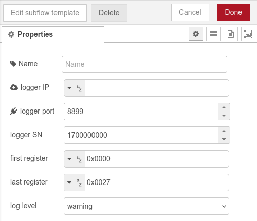
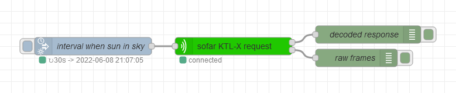
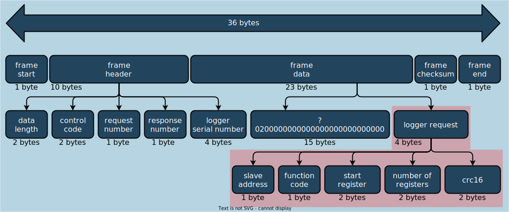
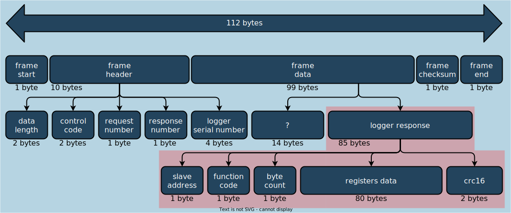

# Node-red TCP modbus request node for Sofar solar LSW-3 data logger

tested on LSW-3 with serial number `17xxxxxxxx` and firmware `LSW3_14_FFFF_1.0.34`  
connected to sofar 4.4 KTL-X inverter.

modbus communication based on [MichaluxPL](https://github.com/MichaluxPL)/[Sofar_LSW3](https://github.com/MichaluxPL/Sofar_LSW3) python script.

## requirements
  - node-red 3.0
  - [crc module](https://www.npmjs.com/package/crc) (node-red should download and install it on first node deploy)
  - (optional) [node-red-contrib-sun-position](https://flows.nodered.org/node/node-red-contrib-sun-position) node-red library

## setup

- import [node-red subflow](sofar-KTL-x-request.json) to node-red, you will get `sofar KTL-X request` node in subflow category.
- input your logger IP address and serial number in node properties  
    
- setup `inject` node to inject once after 1s and than repeat at interval you want to get data from inverter  
    
  - to request data only between sunrise and sunset i'm using [`time-inject` node](https://github.com/rdmtc/node-red-contrib-sun-position/wiki/time-inject)  
  from [node-red-contrib-sun-position](https://flows.nodered.org/node/node-red-contrib-sun-position) node-red library.
- decoded data from inverter will be on first output.
  ```javascript
  {
    "inverterStatus": "normal",
    "errors": {
        "fault1": 0,
        "fault2": 0,
        "fault3": 0,
        "fault4": 0,
        "fault5": 0
    },
    "PV": {
        "string1": {
            "voltage": 455.1,
            "current": 2.74,
            "power": 1240
        },
        "string2": {
            "voltage": 79.1,
            "current": 0,
            "power": 0
        }
    },
    "grid": {
        "activePower": 1180,
        "reactivePower": -0.63,
        "frequency": 49.99,
        "L1_V": 233,
        "L1_A": 1.97,
        "L2_V": 228.6,
        "L2_A": 1.97,
        "L3_V": 227.6,
        "L3_A": 1.96
    },
    "production": {
        "TotalEnergy": 6333,
        "TotalTime": 5856,
        "TodayEnergy": 9.67,
        "TodayTime": 576
    },
    "info": {
        "loggerTemp": 33,
        "inverterTemp": 47,
        "Vbus": 634.2,
        "PV1VCPU": 455.2,
        "PV1ACPU": 8.07,
        "countdownTime": 60,
        "inverterAlarmInfo": 0,
        "inputMode": "independent",
        "inverterInnerInfo": 0,
        "PV1insulationResistance": 1212,
        "PV2insulationResistance": 2263,
        "cathode_groundInsulationImpedance": 1856,
        "countryCode": 12
    },
    "timestamp": 1654692048
  }
  ```
  - there is  msg.debug property with additional frame info.
- on second output are raw buffers sent to/from inverter.

# frames diagrams

request frame



response frame


